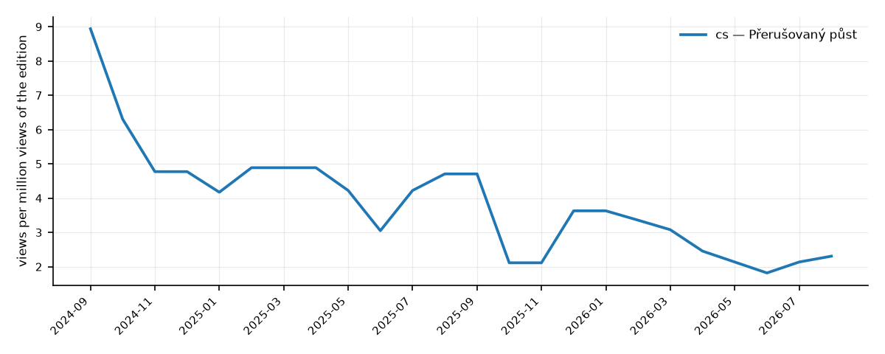
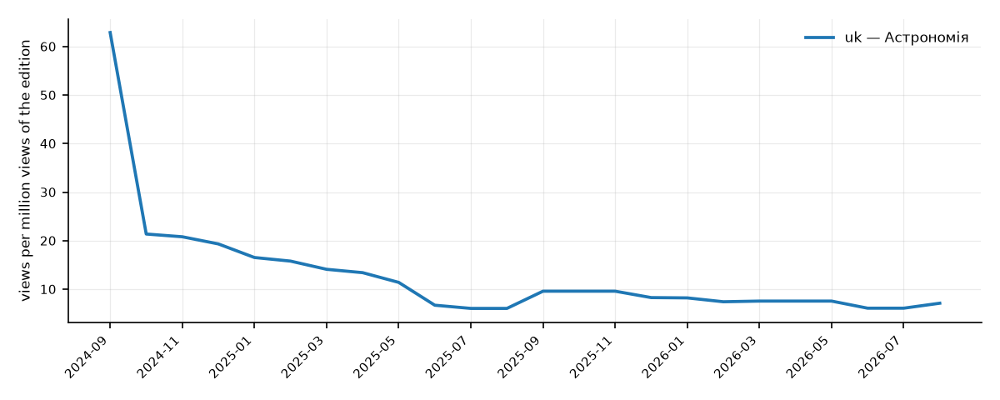
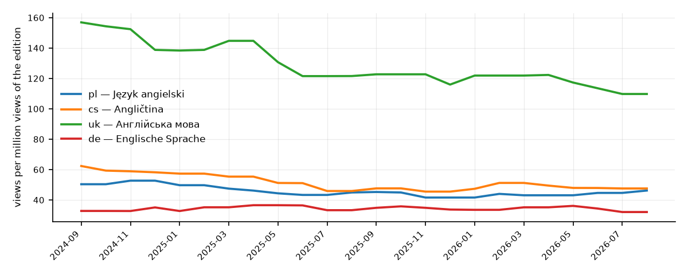

# Examples

The three example requests from the task, run through the skill's CLI on 2026-09-26.
Each folder has the chart (`chart.png`), the one-page PDF report (`report.pdf`) and the
raw CLI output (`compare.json` / `analyze.json`) the agent relays. Every number below
is copied from that output; nothing is computed by hand.

To regenerate (numbers will move as new months of data arrive):

```bash
R="uv run --extra report python scripts/wikitrends.py"
$R compare Q1666254 --langs pl,cs --period 24m                                 # 1
$R analyze Q333 --langs uk --period 24m                                        # 2
$R compare Q1860 --langs pl,cs,uk,de --period 24m --weights growth=0.6,volume=0.4  # 3
# after each one:
$R chart  --from-last --out "$PWD/chart.png"
$R report --from-last --out "$PWD/report.pdf"
```

---

## 1. Intermittent fasting: Polish vs Czech, last two years

> Compare the growth of interest in intermittent fasting on Polish and Czech Wikipedia
> over the last two years.



[report.pdf](01-intermittent-fasting-pl-cs/report.pdf) · [compare.json](01-intermittent-fasting-pl-cs/compare.json)

- **pl: no article.** Polish Wikipedia has no article on intermittent fasting (Wikidata
  Q1666254 has no plwiki sitelink). The skill excludes pl from the ranking with that reason
  instead of reporting zero interest. The missing article is itself a signal: the topic is
  not covered in that edition.
- **cs: interest is declining by 47.2% per year** (~3.04 views per million, p=0.0004),
  confidence **medium**: small base (~183 views/month), strong seasonality with peaks in
  months 1, 4, 8, 9, 10.

A pl vs cs comparison of growth is therefore not possible on this data; the honest answer
is "cs is declining, pl has no article to measure".

## 2. Astronomy on Ukrainian Wikipedia: is the growth real?

> We are thinking of adding an astronomy course to our education app. Is interest in
> this topic growing on Ukrainian Wikipedia, and how far can this growth be trusted?



[report.pdf](02-astronomy-uk/report.pdf) · [analyze.json](02-astronomy-uk/analyze.json)

- **Not growing: declining by 50.0% per year** (~9.7 views per million), confidence
  **high**: the decline is significant (p=0.0001).
- Year over year: 9.7 vs 17.79 views per million per month (−45.5%), on matching months.
- Strong seasonality with peaks in September–December (school year).
- The tool flags spike days on 3–4 September 2024 (up to 17× the median). The trend
  estimate (Theil–Sen) is robust to them, and year-over-year gives the same direction.

## 3. Learning English: which audiences to research next

> We are building a language-learning app. Compare interest in learning English in the
> language editions we chose and prepare a short report: which audiences should we research
> next and why?

Editions: pl, cs, uk, de. "Learning English" has no single article, so the query resolves
as ambiguous; the user chose the **"English language" article (Q1860)** as a proxy and said
growth matters more than volume (`--weights growth=0.6,volume=0.4`).



[report.pdf](03-learning-english/report.pdf) · [compare.json](03-learning-english/compare.json)

| Lang | Views per million | Trend, %/yr | Confidence | Score |
|---|---|---|---|---|
| uk | 119.54 | −16.0 | high | 0.652 |
| cs | 48.3 | −12.3 | high | 0.425 |
| pl | 43.52 | −9.7 | high | 0.417 |
| de | 34.4 | not significant | medium | 0.353 |

**Research next: uk, cs, pl.** Why, from `recommendation.why`:

- uk leads on volume (100% of the leader) with high confidence, despite the steepest decline.
- cs and pl are close (40% and 36% of the leader's volume); both declines are significant.
- de has the lowest volume, and its trend is not significant, so it earns nothing for growth.

Interest is declining in every edition with a significant trend. That is consistent with
the overall fall in Wikipedia traffic since 2024 and is only partly removed by normalisation.

---

## Limitations (returned with every result)

- Wikipedia page views are a signal of attention, not of willingness to pay.
- Share per million compares language editions, not country audiences: readers of an
  edition can live anywhere.
- Some bot traffic is not caught by the agent=user filter.
- Since 2024 overall Wikipedia views have been falling due to AI answers in search;
  per-edition normalisation compensates for this only partially.
